<div align="center">


# 🚀 Project Lift & Shift — AWS Cloud Migration
### Multi-Tier Web Application (VPROFILE) on AWS

[](https://aws.amazon.com/)
[](https://aws.amazon.com/ec2/)
[](https://maven.apache.org/)
[](https://tomcat.apache.org/)
[](https://www.mysql.com/)
[](https://www.rabbitmq.com/)
[](https://memcached.org/)

</div>

---

## 📌 About The Project

This project demonstrates a **production-grade cloud migration** of the multi-tier VPROFILE web application to AWS using a **Lift & Shift strategy**. The workload is moved from on-premises/local infrastructure to AWS Cloud — improving scalability, availability, and cost-efficiency **without redesigning** the application architecture.

> 🔁 **Lift & Shift** = Same architecture, new home in the cloud.

---

## 🎯 Objectives

| Goal | Description |
|------|-------------|
| ☁️ Flexible Infra | Infrastructure that adapts to changing workloads automatically |
| 💰 No Upfront Cost | Leverage AWS's pay-as-you-go model |
| 🔄 Modernize Effectively | Transition from legacy environments to cloud infrastructure |
| 🏗️ IAAC Foundation | Lay the groundwork for automated infrastructure provisioning |

---

## 🏗️ Architecture Overview

> The diagram below shows the complete cloud architecture — from end-users through GoDaddy DNS → ALB → Tomcat App Server → Backend Services (MySQL, Memcached, RabbitMQ), with Route 53 private DNS and S3 for artifact storage.

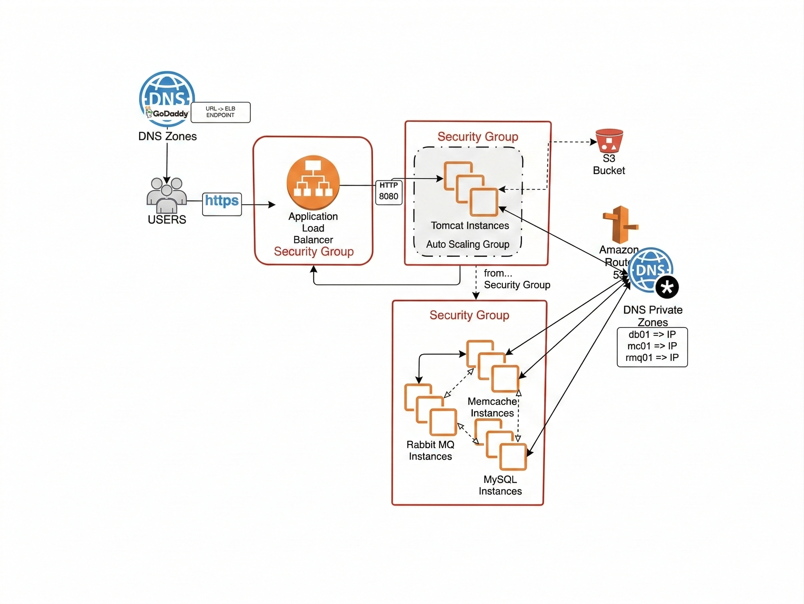

---

## 🛠️ AWS Services Used

<table>
  <thead>
    <tr>
      <th>Service</th>
      <th>Icon</th>
      <th>Purpose</th>
      <th>Docs</th>
    </tr>
  </thead>
  <tbody>
    <tr>
      <td><strong>EC2</strong></td>
      <td></td>
      <td>Virtual Machines for Tomcat, RabbitMQ, Memcached, MySQL</td>
      <td><a href="https://docs.aws.amazon.com/ec2/">📄 EC2 Docs</a></td>
    </tr>
    <tr>
      <td><strong>ELB (ALB)</strong></td>
      <td></td>
      <td>Distributes incoming HTTPS traffic across application targets</td>
      <td><a href="https://docs.aws.amazon.com/elasticloadbalancing/">📄 ELB Docs</a></td>
    </tr>
    <tr>
      <td><strong>Auto Scaling</strong></td>
      <td></td>
      <td>Automated VM scaling based on traffic demands</td>
      <td><a href="https://docs.aws.amazon.com/autoscaling/">📄 Auto Scaling Docs</a></td>
    </tr>
    <tr>
      <td><strong>S3</strong></td>
      <td></td>
      <td>Artifact storage for application WAR file</td>
      <td><a href="https://docs.aws.amazon.com/s3/">📄 S3 Docs</a></td>
    </tr>
    <tr>
      <td><strong>Route 53</strong></td>
      <td></td>
      <td>Private DNS — maps hostnames to private IPs (e.g., <code>db01.LiftAandShift.in</code>)</td>
      <td><a href="https://docs.aws.amazon.com/route53/">📄 Route 53 Docs</a></td>
    </tr>
    <tr>
      <td><strong>IAM</strong></td>
      <td></td>
      <td>User & Role management for S3 access</td>
      <td><a href="https://docs.aws.amazon.com/iam/">📄 IAM Docs</a></td>
    </tr>
    <tr>
      <td><strong>ACM</strong></td>
      <td></td>
      <td>SSL/HTTPS certificates for secure communication</td>
      <td><a href="https://docs.aws.amazon.com/acm/">📄 ACM Docs</a></td>
    </tr>
  </tbody>
</table>

---

## ⚙️ Technology Stack

| Layer | Technology | Version |
|-------|-----------|---------|
| App Server |  Apache Tomcat | 10 |
| Database |  MySQL | 8 |
| Cache |  Memcached | Latest |
| Queue |  RabbitMQ | Latest |
| Build Tool |  Apache Maven | 3 |
| OS |  Ubuntu | 22.04 LTS |

---

## ✅ Prerequisites

### 🔧 Local Build Requirements

| Tool | Version | Official Download |
|------|---------|-------------------|
|  **Java JDK** | 11 | [📥 Eclipse Temurin JDK 11](https://adoptium.net/temurin/releases/?version=11) |
|  **Apache Maven** | 3.x | [📥 Maven Download](https://maven.apache.org/download.cgi) · [📄 Install Guide](https://maven.apache.org/install.html) |
|  **MySQL** | 8.x | [📥 MySQL Community Server](https://dev.mysql.com/downloads/mysql/) · [📄 Docs](https://dev.mysql.com/doc/refman/8.0/en/) |

### ☁️ AWS & DevOps Requirements

- [x] An active **AWS Account** — [Create one here](https://aws.amazon.com/free/)
- [x] **AWS CLI v2** installed and configured — [📄 Install Guide](https://docs.aws.amazon.com/cli/latest/userguide/install-cliv2.html)
- [x] **Git** installed — [📥 Download](https://git-scm.com/downloads)
- [x] Basic knowledge of AWS Console navigation

---

## 🧰 Technologies Used

### Application Framework

| Technology | Badge | Official Docs |
|-----------|-------|---------------|
| **Spring MVC** |  | [📄 Spring MVC Docs](https://docs.spring.io/spring-framework/docs/current/reference/html/web.html) |
| **Spring Security** |  | [📄 Spring Security Docs](https://docs.spring.io/spring-security/reference/index.html) |
| **Spring Data JPA** |  | [📄 Spring Data JPA Docs](https://docs.spring.io/spring-data/jpa/docs/current/reference/html/) |
| **Maven** |  | [📄 Maven Docs](https://maven.apache.org/guides/index.html) |
| **JSP** |  | [📄 JSP Docs](https://jakarta.ee/specifications/pages/) |

### Infrastructure & Services

| Technology | Badge | Official Docs |
|-----------|-------|---------------|
| **Apache Tomcat** |  | [📄 Tomcat 10 Docs](https://tomcat.apache.org/tomcat-10.1-doc/index.html) |
| **MySQL** |  | [📄 MySQL 8 Docs](https://dev.mysql.com/doc/refman/8.0/en/) |
| **Memcached** |  | [📄 Memcached Docs](https://github.com/memcached/memcached/wiki) |
| **RabbitMQ** |  | [📄 RabbitMQ Docs](https://www.rabbitmq.com/documentation.html) |
| **ElasticSearch** |  | [📄 Elasticsearch Docs](https://www.elastic.co/guide/en/elasticsearch/reference/current/index.html) |

---

## 🗄️ Database Setup

This project uses **MySQL 8** as the primary relational database.

### DB Dump File Location

```
src/main/resources/db_backup.sql
```

> The `db_backup.sql` file is a **MySQL dump** containing the full schema and seed data for the `accounts` database.

### Import the Database

```bash
# Quick import
mysql -u <user_name> -p accounts < db_backup.sql
```

**Step-by-step:**

```bash
# 1. Log into MySQL
mysql -u root -p

# 2. Create the database (if not already created)
CREATE DATABASE accounts;
EXIT;

# 3. Import the dump file
mysql -u root -p accounts < src/main/resources/db_backup.sql
```

> 📄 [MySQL Import/Export Docs](https://dev.mysql.com/doc/refman/8.0/en/mysqldump.html)

---

## 🔒 Security Groups

Three security groups are created to enforce a **layered security model** (defense in depth):

### 1️⃣ Load Balancer Security Group — `LiftAndShift-ELB-SG`

Allows inbound traffic only from the **public internet** (HTTP + HTTPS):

| Type | Protocol | Port | Source |
|------|----------|------|--------|
| HTTP | TCP | 80 | `0.0.0.0/0` , `::/0` |
| HTTPS | TCP | 443 | `0.0.0.0/0` , `::/0` |

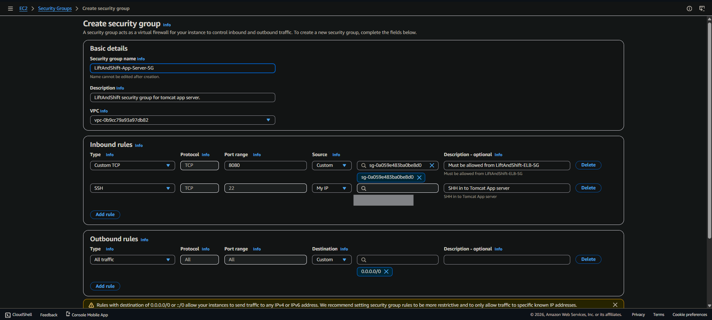
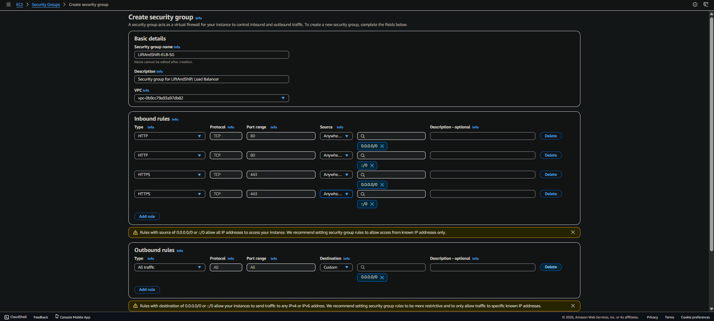

> 📄 [Security Groups Docs](https://docs.aws.amazon.com/vpc/latest/userguide/vpc-security-groups.html)

---

### 2️⃣ Tomcat App Server Security Group — `LiftAndShift-App-Server-SG`

Allows inbound traffic only from the **Load Balancer SG** on port 8080:

| Type | Protocol | Port | Source |
|------|----------|------|--------|
| Custom TCP | TCP | 8080 | `LiftAndShift-ELB-SG` |
| SSH | TCP | 22 | My IP |


---

### 3️⃣ Backend Services Security Group — `LiftAndShift-Backend-Server-SG`

Allows inbound traffic only from the **App Server SG**, plus a self-referencing rule for inter-service communication:

| Service | Protocol | Port | Source |
|---------|----------|------|--------|
| MySQL/Aurora | TCP | 3306 | `LiftAndShift-App-Server-SG` |
| Memcached | TCP | 11211 | `LiftAndShift-App-Server-SG` |
| RabbitMQ | TCP | 5672 | `LiftAndShift-App-Server-SG` |
| SSH | TCP | 22 | My IP |
| All Traffic (internal) | All | All | `LiftAndShift-Backend-Server-SG` (self-reference) |

> ⚠️ The **self-referencing rule** (All traffic from itself) must be added **after** the SG is first created, enabling MySQL, Memcached, and RabbitMQ to talk to each other internally.

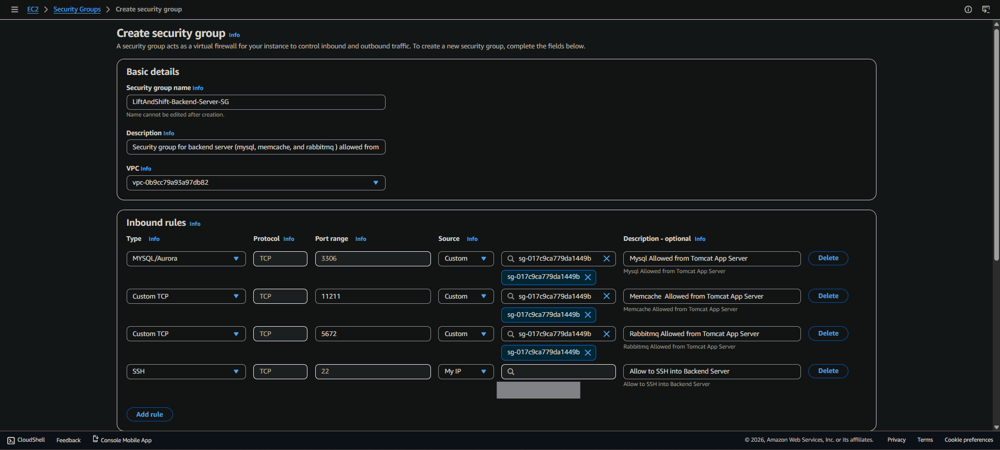
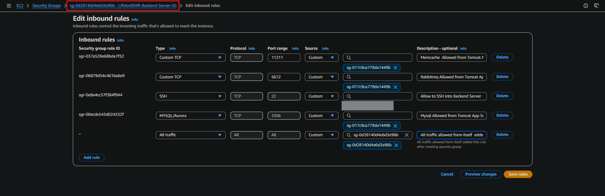
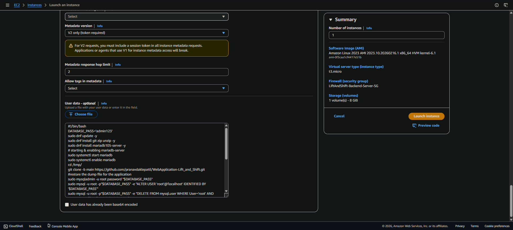

---

## 🚀 Flow of Execution

### Step 1 — Create Key Pair

```bash
# AWS Console → EC2 → Key Pairs → Create Key Pair
Name: vprofile-prod-key
Type: RSA
Format: .pem
```

> 📄 [EC2 Key Pairs Docs](https://docs.aws.amazon.com/AWSEC2/latest/UserGuide/ec2-key-pairs.html)

---

### Step 2 — Create Security Groups

Create the three security groups described in the [Security Groups](#-security-groups) section above via **AWS Console → EC2 → Security Groups → Create Security Group**. Follow the screenshots in that section for exact rule configuration.

---

### Step 3 — Launch EC2 Instances with User Data

Launch instances with the correct security groups and **User Data** provisioning scripts for automated bootstrapping at first boot:

| Instance Name | AMI | Security Group | User Data Script |
|---------------|-----|----------------|-----------------|
| `LiftAndShift-app01` | Ubuntu 22.04 | `LiftAndShift-App-Server-SG` | `tomcat_ubuntu.sh` |
| `LiftAndShift-db01` | Amazon Linux 2023 | `LiftAndShift-Backend-Server-SG` | `mysql.sh` |
| `LiftAndShift-mc01` | Amazon Linux 2023 | `LiftAndShift-Backend-Server-SG` | `memcache.sh` |
| `LiftAndShift-rmq01` | Amazon Linux 2023 | `LiftAndShift-Backend-Server-SG` | `rabbitmq.sh` |

> The `mysql.sh` script installs MariaDB, clones the application repo from GitHub, and auto-restores the DB dump on first boot.


> 📄 [EC2 Launch Instances Docs](https://docs.aws.amazon.com/AWSEC2/latest/UserGuide/EC2_GetStarted.html) · [📄 EC2 User Data Docs](https://docs.aws.amazon.com/AWSEC2/latest/UserGuide/user-data.html)

---

### Step 4 — Route 53 Private Hosted Zone

Create a **private hosted zone** scoped to your VPC, then add DNS `A` records mapping each backend hostname to its **Private IP**:

```
Hosted Zone Name : LiftAandShift.in   (Type: Private — associated with your VPC)

db01.LiftAandShift.in   →  172.31.68.80   (Private IP of LiftAndShift-db01)
mc01.LiftAandShift.in   →  172.31.78.35   (Private IP of LiftAndShift-mc01)
rmq01.LiftAandShift.in  →  172.31.79.144  (Private IP of LiftAndShift-rmq01)
```

> These DNS names are referenced in `application.properties` so the app server can reach backend services by name instead of hardcoded IPs.

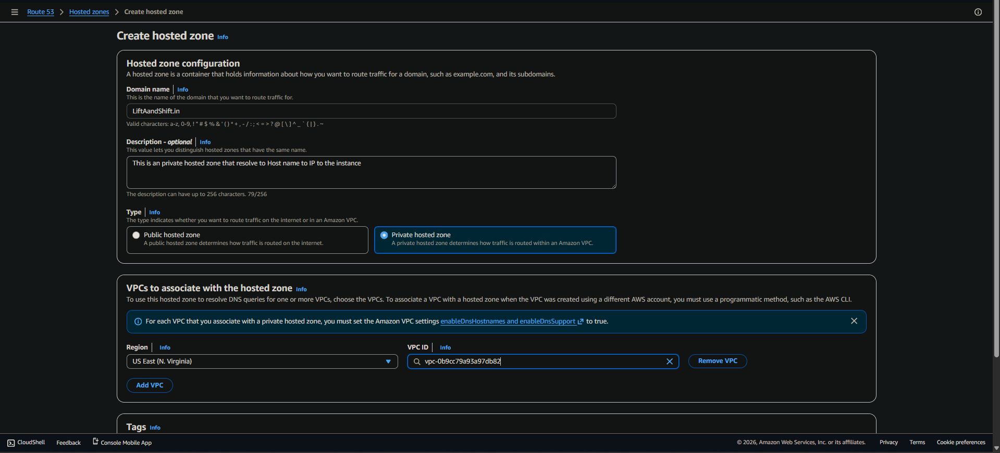

> 📄 [Route 53 Private Hosted Zones Docs](https://docs.aws.amazon.com/Route53/latest/DeveloperGuide/hosted-zones-private.html)

---

### Step 5 — IAM Configuration

#### 5a. Create IAM User with S3 Full Access

Create a programmatic IAM user for AWS CLI artifact uploads:

```
AWS Console → IAM → Users → Create User
Name: LiftAndShift-Admin
Permissions: AmazonS3FullAccess
→ Create Access Key → Download credentials CSV
```


#### 5b. Create IAM Role for EC2 → S3 Access

```
AWS Console → IAM → Roles → Create Role
Trusted Entity: EC2
Permissions: AmazonS3FullAccess
Name: vprofile-ec2-s3-role
→ Attach role to LiftAndShift-app01 instance
   (EC2 → Instances → Actions → Security → Modify IAM Role)
```

> 📄 [IAM Users Docs](https://docs.aws.amazon.com/IAM/latest/UserGuide/id_users.html) · [📄 IAM Roles for EC2 Docs](https://docs.aws.amazon.com/IAM/latest/UserGuide/id_roles_use_switch-role-ec2.html)

---

### Step 6 — Build the Artifact

Build the application locally using Maven:

```bash
# In your project root
mvn install
```

The WAR artifact is generated at:

```
target/vprofile-v2.war
```


> 📄 [Apache Maven Docs](https://maven.apache.org/guides/getting-started/)

---

### Step 7 — Create S3 Bucket & Upload Artifact

#### 7a. Create the S3 Bucket

```
AWS Console → S3 → Create Bucket
Bucket Name   : LiftAndShift-Bucket
Region        : US East (N. Virginia) us-east-1
Bucket Type   : General Purpose
Object Ownership : ACLs disabled (recommended)
```


#### 7b. Configure AWS CLI & Upload

```bash
# Configure AWS CLI with LiftAndShift-Admin credentials
aws configure

# Upload the built artifact to S3
aws s3 cp target/vprofile-v2.war s3://liftandshifts3/
```

> 📄 [AWS S3 Docs](https://docs.aws.amazon.com/s3/) · [📄 AWS CLI S3 Reference](https://docs.aws.amazon.com/cli/latest/reference/s3/)

---

### Step 8 — Deploy Artifact on App Server

SSH into the app server. The attached IAM Role gives the instance permission to pull from S3 without any credentials:

```bash
# SSH into app server
ssh -i vprofile-prod-key.pem ubuntu@<app01-public-ip>

# Switch to root
sudo -i

# Pull artifact from S3 (IAM role auth — no keys needed)
aws s3 cp s3://liftandshifts3/vprofile-v2.war /tmp/

# Stop Tomcat
systemctl stop tomcat10.service
systemctl daemon-reload

# Remove old deployment
rm -rf /var/lib/tomcat10/webapps/ROOT

# Deploy new WAR as ROOT
mkdir -p /var/lib/tomcat10/webapps
cp -f /tmp/vprofile-v2.war /var/lib/tomcat10/webapps/ROOT.war

# Start Tomcat
systemctl start tomcat10.service

# Verify — Tomcat will unpack ROOT.war automatically
ls /var/lib/tomcat10/webapps
# → ROOT.war  ROOT/
```

> 📄 [Apache Tomcat Deployment Docs](https://tomcat.apache.org/tomcat-10.1-doc/deployer-howto.html)

---

### Step 9 — Create Target Group

Create a target group pointing to the app server on port 8080:

```
AWS Console → EC2 → Target Groups → Create Target Group
Target Type       : Instances
Name              : LiftAndShift-TG
Protocol          : HTTP
Port              : 8080
IP Address Type   : IPv4
Health Check Protocol : HTTP
Health Check Path : /
Health Check Port : Override → 8080
Healthy Threshold : 5
Unhealthy Threshold: 2
→ Register Target: LiftAndShift-app01 (port 8080)
```

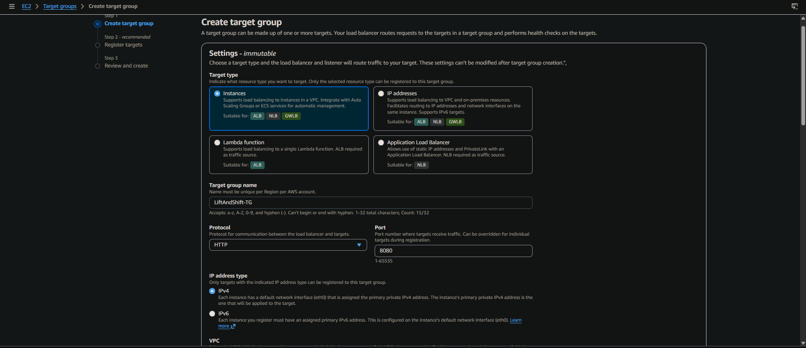
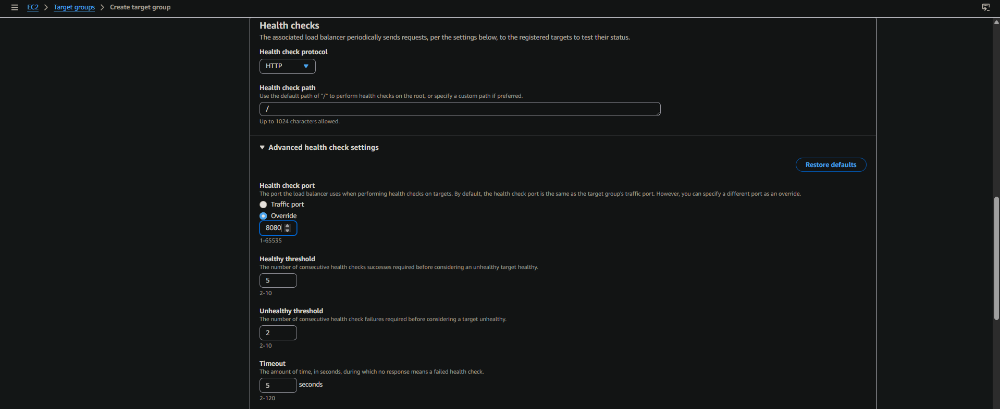
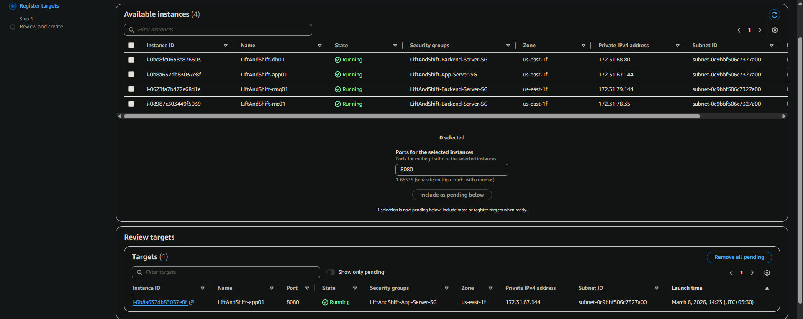

> 📄 [Target Groups Docs](https://docs.aws.amazon.com/elasticloadbalancing/latest/application/load-balancer-target-groups.html)

---

### Step 10 — Create Application Load Balancer

#### 10a. Basic Configuration

```
AWS Console → EC2 → Load Balancers → Create Application Load Balancer
Name   : LiftAndShift-ELB
Scheme : Internet-facing
IP Type: IPv4
```

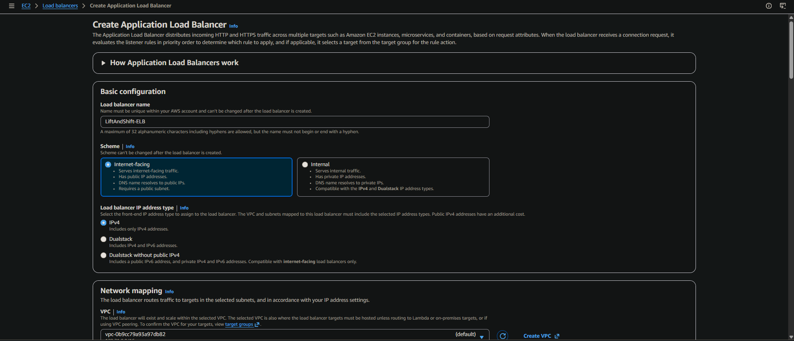

#### 10b. Network Mapping

```
VPC: vpc-0b9cc79a93a97db82 (default)
Availability Zones: Select all AZs
  ✅ us-east-1a  ✅ us-east-1b  ✅ us-east-1c
  ✅ us-east-1d  ✅ us-east-1e  ✅ us-east-1f
```

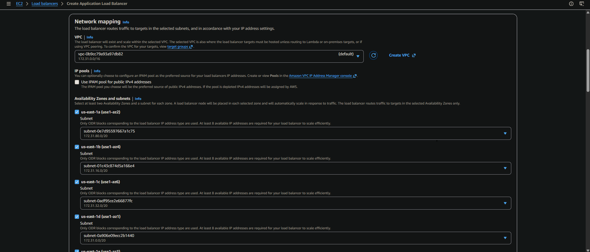

#### 10c. Security Group & Listener Routing

```
Security Group : LiftAndShift-ELB-SG
Listener       : HTTP:80 → Forward to LiftAndShift-TG (weight: 1)
```

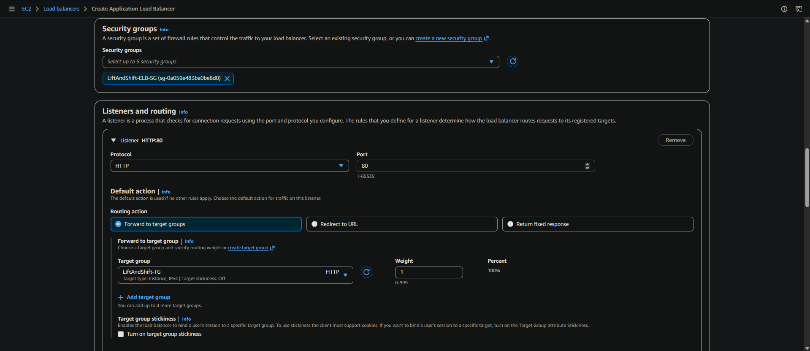

#### 10d. Load Balancer Active

Once created, the ALB status shows **Active** across 6 Availability Zones:

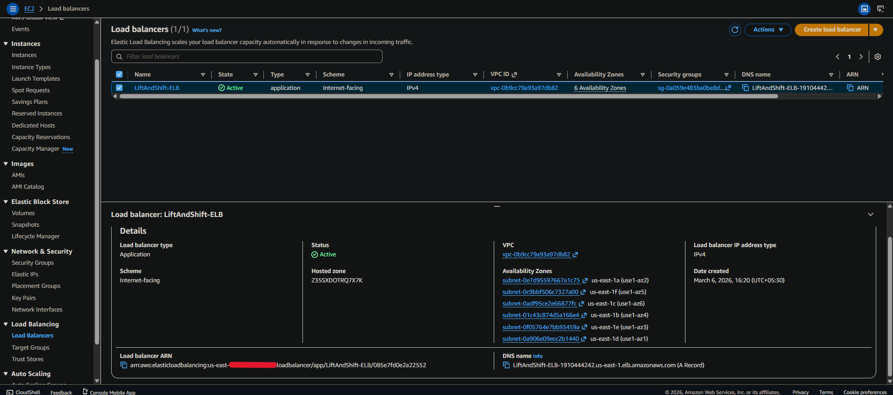

> 📄 [Application Load Balancer Docs](https://docs.aws.amazon.com/elasticloadbalancing/latest/application/introduction.html)

---

### Step 11 — Map Domain & Verify

Map your custom domain to the ALB DNS name via your DNS provider (e.g., GoDaddy):

```
Type  : CNAME
Host  : vprofile
Value : LiftAndShift-ELB-<id>.us-east-1.elb.amazonaws.com
```

Open the ELB DNS endpoint in your browser to confirm the app is live:


> ✅ **Application successfully deployed!** The VPROFILE login page is accessible via the Load Balancer endpoint.

---

## 📁 Project Structure

```
Project_LiftAndShift/
├── src/
│   └── main/
│       └── resources/
│           └── db_backup.sql           # MySQL dump file
├── target/
│   └── vprofile-v2.war                 # Built artifact (generated by mvn install)
├── userdata/
│   ├── mysql.sh                        # MySQL/MariaDB provisioning script
│   ├── memcache.sh                     # Memcached provisioning script
│   ├── rabbitmq.sh                     # RabbitMQ provisioning script
│   └── tomcat_ubuntu.sh                # Tomcat provisioning script
├── screenshorts/                       # Project screenshots (all 20)
│   ├── Architecture.png
│   ├── LiftAndShift-ELB-SG.png
│   ├── SecurityGroupForELB.png
│   ├── LiftAndShift-Backend-Server-SG.png
│   ├── Edit-LiftAndShift-Backend-Server-SG.png
│   ├── Edit-LiftAndShift-Backend-Server-mysql-db01-2.png
│   ├── Screenshot_2026-03-05_113836.png
│   ├── Instances_.png
│   ├── HostedZone.png
│   ├── IAM_User_.png
│   ├── Screenshot_2026-03-05_121844.png
│   ├── S3_Bucket_.png
│   ├── TG-1.png
│   ├── TG-2.png
│   ├── TG-3.png
│   ├── ELB-1.png
│   ├── ELB-2.png
│   ├── ELB-3.png
│   ├── ELB-4.png
│   └── ELB-5-working_.png
├── pom.xml                             # Maven build configuration
└── README.md
```

---

## 🤝 Contributing

Contributions, issues and feature requests are welcome!

1. Fork the repository
2. Create a feature branch: `git checkout -b feature/amazing-feature`
3. Commit your changes: `git commit -m 'Add amazing feature'`
4. Push to the branch: `git push origin feature/amazing-feature`
5. Open a Pull Request

---

## 📜 License

Distributed under the MIT License. See `LICENSE` for more information.

---

<div align="center">

Made with ❤️ | AWS Cloud Migration Project

[](https://aws.amazon.com/)

</div>